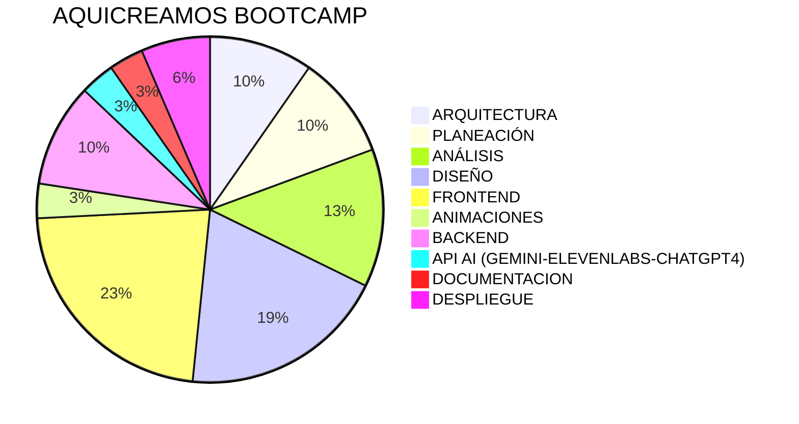
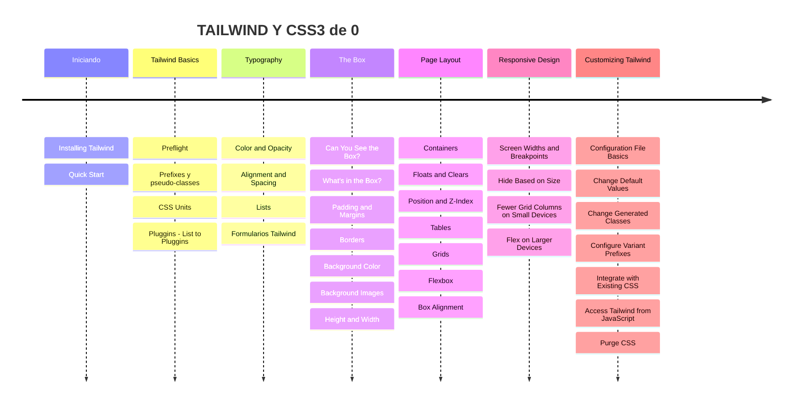

# Bienvenidos al aprendizaje de JS, TS y NEXT JS de TI con JS, Diseño y Arquitectura

## Vamos a estar trabajando con un bootcamp donde incluiremos practicas de laboratorio en cada Tecnica y las contextualizaremos usando AI y Sheet Cheet la parte academica se va a divir en 6 partes cada una de ellas con su respectivo aspecto teorico para formarnos como fullstack 

## Tecnologías 

### Analiticas ( Tiempo: 3h 45m - Teorica 2h )
Arquitecturas -> Protipados -> Requerimientos -> Diseño -> Analisis -> Tecnologías | Pendientes:  Patrones de Diseño

---

### Diseño ( Tiempo: 8h - Teórica 2h - Design Tocken 4h )
Herramienta vectoriales -> Taller de Figma uso completo de la herramienta -> introducción a Storybook -> Atomic Design -> Design Systems -> Design Tockens 

---
### Introducción a Javascript desde el Backend / Frontend ( Tiempo: 4h + 4h + 3h + 1h - Teórica: 5h )

Javascript y Nodejs, Introducción a las instalaciones / configuraciones con packagejson y NPM, Status, Routers Node, JS: For - While - IF - Map - Middlewares, Openai Introducción, Fetch front y back (GET, POST, PUT, DELETE), Taller de Entrenamiento de IA con chatgpt API, Input fetch preload, Input get Audio convert searchH CHATGPT API (3), Uso de ElevenLabs, POSTGRESQL NODE JS
---

### Frontend ( Tiempo: 8h + 12h + 8h + 5h + 6h - 4h - 3h Teórica: 12h )

Aprende de 0 HTML5 

1. Structure y Doctypes
2. Paragraph y Text formatting
3. Links
4. Lists
5. Images
6. Tables
7. Forms
8. Extra Markup 
9. Data formating
10. Introducing CSS 11. Color
12. Text
13. Boxes and Sectioning
14. Iframes
15. Layout HTML5
15. Semantic Layout HTML5
Intro to Inputs
	> input -> captura datos tipo texto o numero
	> select -> datos prehechos a seleccionar 
	> input -> radio - circulo unico
        > input -> checkbox -> cuadrado multiple
	> textarea -> parrafo
	> form -> get | post | put | delete
	> input -> submit 
17. Media elements - Video & Audio 

---

Aprende de 0 Tailwind y CSS3

---

Introduccion a las maquetaciones con React y Next js

---

Proximamente Maquetaciones con -> Next UI 

---

Javascript -> TypeScript -> Next js -> React - Zustand js -> React Query -> Framer motion ->  Scroll Animations -> Animations -> Formik

### Backend ( Tiempo: 4h + 4h + 3h + 1h - Teórica: 5h )
Pendientes:  Patrones de Diseño -> Diseño del backend -> Python FastAPI -> Autenticación JWT AUTH  -> SQL - MYSQL -> json Mocks

### Repository ( Tiempo: 1h - Teórica: 15m )
-> GIT- GITHUB

### Despliegue ( Tiempo: 3h - Teórica: 3h )

### Tiempo FINAL aprox 22 dias 

## Contributing

Estos han sido las personas que han contribuido a nuestro proyecto!
Mira `contributing.md` para que puedas ver el listado de contribuyentes.
Por favor lee el codigo de conducta `code of conduct`.
